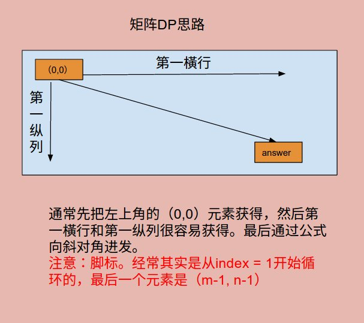

# Problem 64: Minimum Path Sum


> https://leetcode.com/problems/minimum-path-sum/

----------------------------------------------------
##思路
和前边的题目一样，矩阵型问题，重要的就是想清楚是怎么在这个矩阵中行走的。路线规划好，小心脚标。


-----------------------
```java
public class Solution {
    public int minPathSum(int[][] grid) {
        if (grid == null || grid.length == 0 || grid[0].length == 0) {
            return 0;
        }
        
        //state
        int m = grid.length;
        int n = grid[0].length;
        int[][] f = new int[m][n];
        
        //initiate
        f[0][0] = grid[0][0];
        for (int i = 1; i < n; i++) {
            f[0][i] = f[0][i - 1] + grid[0][i];
        }
        for (int i = 1; i < m; i++) {
            f[i][0] = f[i - 1][0] + grid[i][0];
        }
        
        //function
        for (int i = 1; i < m; i++) {
            for (int j = 1; j < n; j++) {
                f[i][j] = Math.min(f[i - 1][j], f[i][j - 1]) + grid[i][j];
            }
        }
        //answer
        return f[m - 1][n - 1];
    }
}
```
------------------------------------
##易错点

1. 初始化是从1开始的
 ```java
 //initiate
 f[0][0] = grid[0][0];
 for (int i = 1; i < n; i++) {
      f[0][i] = f[0][i - 1] + grid[0][i];
 }
 ```
2. Min函数
   ```java
   Math.min(f[i - 1][j], f[i][j - 1])
   ```
   这个函数写错好几次。第一是把之间的逗号写成加号;第二是总是把Math这个词忘掉


