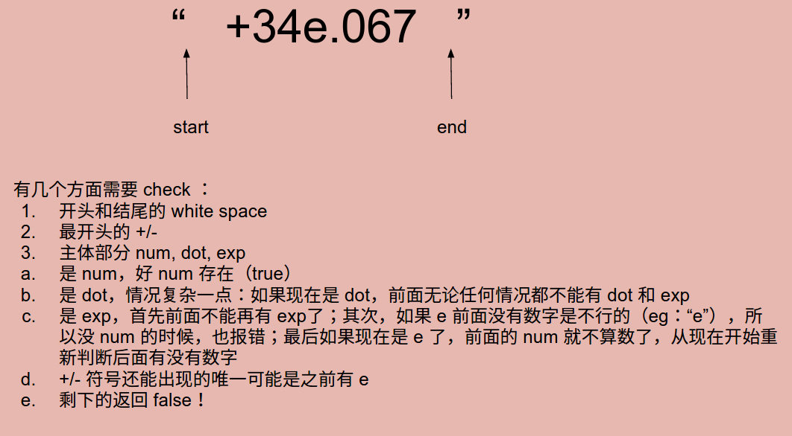

# Problem 65: Valid Number


> https://leetcode.com/problems/valid-number/

-------
##思路


---------
```java
public class Solution {
    public boolean isNumber(String s) {
        int start = 0;
        int end = s.length() - 1;
        
        // check leading and ending white spaces
        while (start <= end && Character.isWhitespace(s.charAt(start))) {
            start++;
        }
        if (start > end) {
            return false;
        }
        while (start <= end && Character.isWhitespace(s.charAt(end))) {
            end--;
        }
        
        // check leading +/-
        if (s.charAt(start) == '+' || s.charAt(start) == '-') {
            start++;
        }
        
        // check main body
        boolean num = false;
        boolean dot = false;
        boolean exp = false;
        while (start <= end) {
            char c = s.charAt(start);
            if (Character.isDigit(c)) {
                num = true;
            } else if (c == '.') {
                if (dot || exp) {
                    return false;
                }
                dot = true;
            } else if (c == 'e') {
                if (exp || num == false) {
                    return false;
                }
                exp = true;
                num = false;
            } else if (c == '+' || c == '-') {
                if (s.charAt(start - 1) != 'e') {
                    return false;
                }
            } else {
                return false;
            }
            
            start++;
        } 
         
        return num; 
    }
}
```
-------
##易错点
1. 前面的 while 判断之后，start 其实是 end + 1 的
```java
while (start <= end && Character.isWhitespace(s.charAt(start))) {
          start++;
}
if (start > end) {
          return false;
}
```
2. char 类型记得用 ''
3. 最后返回的是 num 的类型
```java
return num; 
```
这里的意思是首先经过了之前的各种判断，最后还得满足一点就是：必须得有数字啊！

