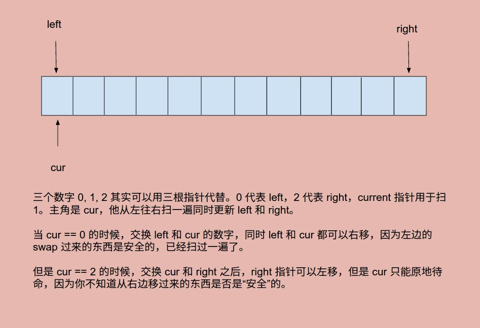

# Problem 75: Sort Colors


> https://leetcode.com/problems/sort-colors/

-------
##思路
* 如图所示 

-------
```java
public class Solution {
    public void sortColors(int[] nums) {
        if (nums == null || nums.length <= 1) {
            return;
        }
        
        int left = 0;
        int right = nums.length - 1;
        int cur = 0;
        while (cur <= right) {
            if (nums[cur] == 0) {
                swap(nums, cur, left);
                left++;
                cur++;
            } else if (nums[cur] == 2) {
                swap(nums, cur, right);
                right--;
            } else {
                cur++;
            }
        }
        
        return;
    }
    
    public void swap(int[] nums, int a, int b) {
        int tmp = nums[a];
        nums[a] = nums[b];
        nums[b] = tmp;
    }
}
```
-----
##易错点

1. 指针移动，谁能移动，谁不行  
因为 cur 是从左边一路走过来的，所以从左边移动过来的东西可以放心，接着移动 cur；而对于从右边过来的东西，因为不确定，所以 cur 不能轻举妄动，先停留在原处。
2. swap 的是数组当中的数字，不是 index


