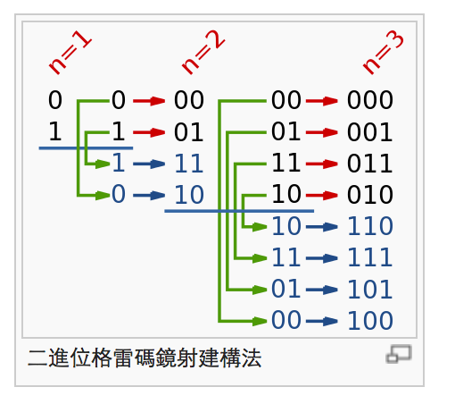

# Problem 89: Gray Code

> https://leetcode.com/problems/gray-code/

---------
##思路
* 用对称和 shift 的方法来做

------------
```java
public class Solution {
    public List<Integer> grayCode(int n) {
        List<Integer> rst = new ArrayList<Integer>();
        rst.add(0);
        
        for (int i = 0; i < n; i++) {
            int shift = 1 << i;
            for (int j = rst.size() - 1; j >= 0; j--) {
                rst.add(rst.get(j) + shift);
            }
        }
        
        return rst;
    }
}
```


