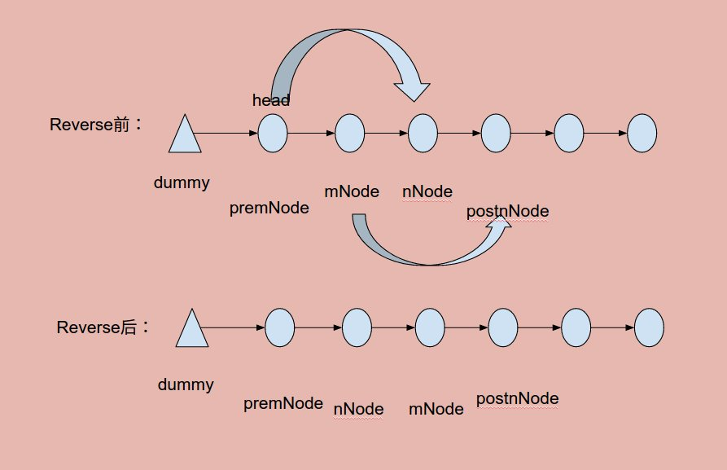

# Problem 92: Reverse Linked List II


> https://leetcode.com/problems/reverse-linked-list-ii/

------------
##思路


1. 找到四个关键点
2. m 到 n 反转
3. 拼接

--------------
```java
/**
 * Definition for singly-linked list.
 * public class ListNode {
 *     int val;
 *     ListNode next;
 *     ListNode(int x) { val = x; }
 * }
 */
public class Solution {
    public ListNode reverseBetween(ListNode head, int m, int n) {
        if (head == null || m >= n) {
            return head;
        }
        
        ListNode dummy = new ListNode(0);
        dummy.next = head;
        head = dummy;
        
        for (int i = 1; i < m; i++) {
            if (head == null) {
                return null;
            }
            head = head.next;
        }
        
        ListNode premNode = head;
        ListNode mNode = head.next;
        ListNode nNode = mNode;
        ListNode postnNode = mNode.next;
        for (int i = m; i < n; i++) {
            if (postnNode == null) {
                return null;
            }
            ListNode temp = postnNode.next;
            postnNode.next = nNode;
            nNode = postnNode;
            postnNode = temp;
        }
        mNode.next = postnNode;
        premNode.next = nNode;
        
        return dummy.next;
    }
}
```
-----
##易错点
1. 建立dummy node
```java
ListNode dummy = new ListNode(0);
dummy.next = head;
head = dummy;
```
2. 移动到 m 点处
```java
for (int i = 1; i < m; i++) {
        if (head == null) {
            return null;
        }
        head = head.next;
}
``` 
注意：这里是从 1 到 m，一共是 （m - 1）次移动。
3. reverse
```java
ListNode temp = postnNode.next;
postnNode.next = nNode;
nNode = postnNode;
postnNode = temp;
```


