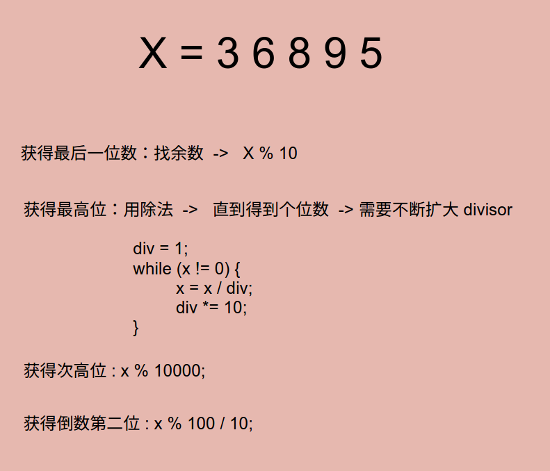

# Problem 9: Palindrome Number


> https://leetcode.com/problems/palindrome-number/

------
##思路


----------
```java
public class Solution {
    public boolean isPalindrome(int x) {
        if (x < 0) {
            return false;
        }
        
        int div = 1;
        while (x / div >= 10) {
            div *= 10;
        }
        while (x != 0) {
            int left = x / div; // get highest pos;
            int right = x % 10; // git lowest pos;
            if (left != right) {
                return false;
            }
            
            x = (x % div) / 10;
            div = div / 100;
        }
        
        return true;
    }
}
```
-----
##易错点
1. 去掉头再去掉尾
```java
  x = (x % div) / 10; // x % div 去掉了头，除以10　去掉尾
```
２. div 除以 100，因为 ｘ 去掉了两位　


