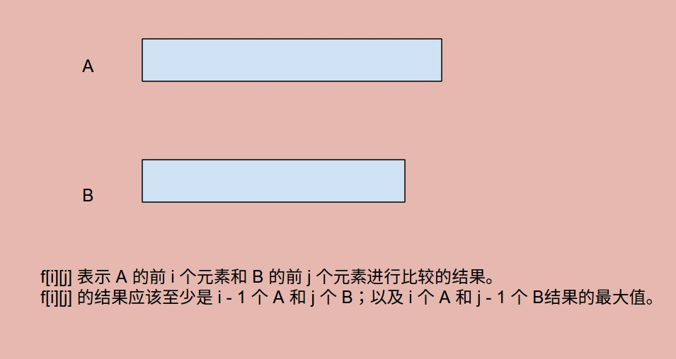

# Problem: Longest Common Subsequence (LintCode)


> http://www.lintcode.com/en/problem/longest-common-subsequence/

-------------------------
##思路



-----------------------
```java
public class Solution {
    /**
     * @param A, B: Two strings.
     * @return: The length of longest common subsequence of A and B.
     */
    public int longestCommonSubsequence(String A, String B) {
        int n = A.length();
        int m = B.length();
        
        int[][] f = new int[n + 1][m + 1];
        for (int i = 1; i <= n; i++) {
            for(int j = 1; j <= m; j++) {
                f[i][j] = Math.max(f[i - 1][j], f[i][j - 1]);
                if (A.charAt(i - 1) == B.charAt(j - 1)) {
                    f[i][j] = f[i - 1][j - 1] + 1;
                }
            }
        }
        
        return f[n][m];
    }
}

```

-----------------------
##易错点

1. 数组的初始化
```java
int[][] f = new int[n + 1][m + 1];
```
只要数组初始化好了，**每个元素的值已经为0了**。这道题看似没有初始化，实际上因为数组初始化后， 已经吧```f[i][0]```和```f[0][j]```初始化为0，所以后面直接进行了操作。
2. 两种条件
```f[i][j] = f[i - 1][j - 1] + 1;```这是A[i]等于B[j]下的条件；如果不等的话，那就是```f[i][j] = Math.max(f[i - 1][j], f[i][j - 1]);```


