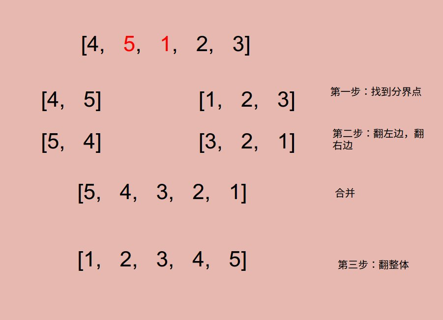

# Problem: Recover Rotated Sorted Array (LintCode)


> http://www.lintcode.com/en/problem/recover-rotated-sorted-array/#

------------
##思路
* 这道题的一个难点在于要**in place**，这是有点难度的
* 大名鼎鼎的**“三步反转法”**


--------------
```java
public class Solution {
    /**
     * @param nums: The rotated sorted array
     * @return: void
     */
    public void recoverRotatedSortedArray(ArrayList<Integer> nums) {
        if (nums == null || nums.size() == 0) {
            return;
        }
        for (int index = 0; index < nums.size() - 1; index++) {
            if (nums.get(index) > nums.get(index + 1)) {
                reverse(nums, 0, index);
                reverse(nums, index + 1, nums.size() - 1);
                reverse(nums, 0, nums.size() - 1);
                return;
            }
        }
    }
    
    private void reverse(ArrayList<Integer> nums, int start, int end) {
        for (int i = start, j = end; i < j; i++, j--) {
            int temp = nums.get(i);
            nums.set(i, nums.get(j));
            nums.set(j, temp);
        }
        return;
    }
}
```
-------
##易错点

1. return的时机
```java
for (int index = 0; index < nums.size() - 1; index++) {
       if (nums.get(index) > nums.get(index + 1)) {
              reverse(nums, 0, index);
              reverse(nums, index + 1, nums.size() - 1);
              reverse(nums, 0, nums.size() - 1);
              return;
       }
}
```
先找到**分界点**
```java
if (nums.get(index) > nums.get(index + 1))
```
因为这是一个递归的函数，所以我们要从最内层一层一层地 return 出来，也就是说，在 if 判读内就要退出

2. 这个 reverse 函数应该记熟
```java
private void reverse(ArrayList<Integer> nums, int start, int end) {
        for (int i = start, j = end; i < j; i++, j--) {
            int temp = nums.get(i);
            nums.set(i, nums.get(j));
            nums.set(j, temp);
        }
        return;
}
```
3. 防止越界
```java
for (int index = 0; index < nums.size() - 1; index++)
```
虽然在中间的某个地方就会找到分界点，但是始终要考虑越界的问题！否则会报错的。


