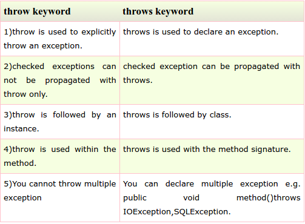

# Sec3: Exception Handling
###73) What is Exception Handling?
Exception Handling is a mechanism to handle runtime errors.It is mainly used to handle checked exceptions.

###74) What is difference between Checked Exception and Unchecked Exception?
**1)Checked Exception**  
The classes that extend Throwable class except RuntimeException and Error are known as checked exceptions e.g.IOException,SQLException etc. Checked exceptions are checked at compile-time.  
**2)Unchecked Exception**   
The classes that extend RuntimeException are known as unchecked exceptions e.g. ArithmeticException,NullPointerException etc. Unchecked exceptions are not checked at compile-time.

###75) What is the base class for Error and Exception?
Throwable.

###76) Is it necessary that each try block must be followed by a catch block?
It is **not necessary** that each try block must be followed by a catch block. It should be followed by either a **catch block** OR a **finally block**. And whatever exceptions are likely to be thrown should be declared in the throws clause of the method.

###77) What is finally block?
finally block is a block that is always executed.

###78) Can finally block be used without catch?
Yes, by try block. finally must be followed by either try or catch.

###79) Is there any case when finally will not be executed?
finally block will not be executed if program exits(either by calling System.exit() or by causing a fatal error that causes the process to abort).

###80) What is difference between throw and throws?

###81) Can an exception be rethrown?
Yes.

###82) Can subclass overriding method declare an exception if parent class method doesn't throw an exception ?
Yes but only unchecked exception not checked.

###83) What is exception propagation ?
Forwarding the exception object to the invoking method is known as exception propagation.

