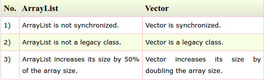

# Sec 10: Java Collection Questions

###1) What is the difference between ArrayList and Vector?

###2) What is the difference between ArrayList and LinkedList?

###3) What is the difference between Iterator and ListIterator?

###4) What is the difference between Iterator and Enumeration?

###5) What is the difference between List and Set?
List can contain duplicate elements whereas Set contains only unique elements.

###6) What is the difference between HashSet and TreeSet?
HashSet maintains **no order** whereas TreeSet maintains **ascending order**.

###7) What is the difference between Set and Map?
Set contains values only whereas Map contains key and values both.

###8) What is the difference between HashSet and HashMap?
HashSet contains only values whereas HashMap contains entry(key,value). HashSet can be iterated but HashMap need to convert into Set to be iterated.

###9) What is the difference between HashMap and TreeMap?
HashMap maintains **no order** but TreeMap maintains **ascending order**.

###10) What is the difference between HashMap and Hashtable?

