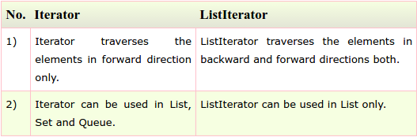

# Sec 10: Java Collection Questions

###1) What is the difference between ArrayList and Vector?

###2) What is the difference between ArrayList and LinkedList?

###3) What is the difference between Iterator and ListIterator?

###4) What is the difference between Iterator and Enumeration?

###5) What is the difference between List and Set?
List can contain duplicate elements whereas Set contains only unique elements.

###6) What is the difference between HashSet and TreeSet?
HashSet maintains **no order** whereas TreeSet maintains **ascending order**.

###7) What is the difference between Set and Map?
Set contains values only whereas Map contains key and values both.

###8) What is the difference between HashSet and HashMap?
HashSet contains only values whereas HashMap contains entry(key,value). HashSet can be iterated but HashMap need to convert into Set to be iterated.

###9) What is the difference between HashMap and TreeMap?
HashMap maintains **no order** but TreeMap maintains **ascending order**.

###10) What is the difference between HashMap and Hashtable?

###11) What is the difference between Collection and Collections?
Collection is an interface whereas Collections is a class. Collection interface provides normal functionality of data structure to List, Set and Queue. But, Collections class is to sort and synchronize collection elements.

###12) What is the difference between Comparable and Comparator?

###13) What is the advantage of Properties file?
If you change the value in properties file, you don't need to recompile the java class. So, it makes the application easy to manage.

###14) What does the hashCode() method?
The hashCode() method returns a hash code value (an integer number).  
The hashCode() method returns the same integer number, if two keys (by calling equals() method) are same.  
But, it is possible that two hash code numbers can have different or same keys.

###15) Why we override equals() method?
The equals method is used to check whether two objects are same or not. It needs to be overridden if we want to **check the objects based on property**.

For example, Employee is a class that has 3 data members: id, name and salary. But, we want to check the equality of employee object on the basis of salary. Then, we need to override the equals() method.

###16) How to synchronize List, Set and Map elements?

###17) What is the advantage of generic collection?
If we use generic class, we don't need typecasting. It is typesafe and checked at compile time.

###18) What is hash-collision in Hashtable and how it is handled in Java?
Two different keys with the same hash value is known as hash-collision. Two different entries will be kept in a single hash bucket to avoid the collision.

###19) What is the Dictionary class?
The Dictionary class provides the capability to store key-value pairs.

###20) What is the default size of load factor in hashing based collection?
The default size of load factor is 0.75. The default capacity is computed as initial capacity * load factor. For example, 16 * 0.75 = 12. So, 12 is the default capacity of Map.

