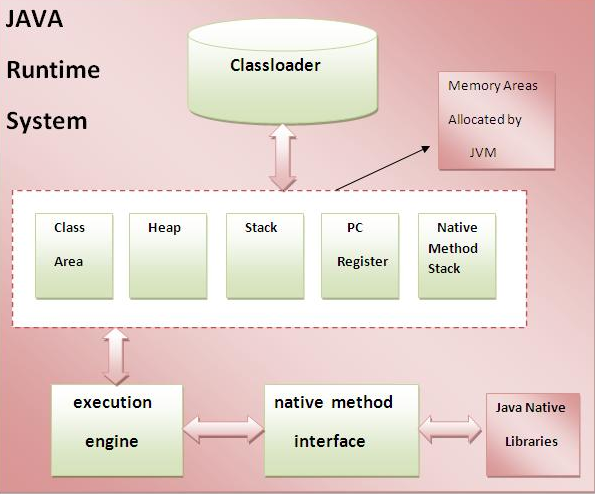

# Sec 1: Basics of Java Questions

###1) What is difference between JDK,JRE and JVM?
**JVM**   
JVM is an acronym for **Java Virtual Machine**, it is an abstract machine which provides the runtime environment in which java bytecode can be executed. It is a specification.
JVMs are available for many hardware and software platforms (so **JVM is platform dependent**).  

**JRE**  
JRE stands for **Java Runtime Environment**. It is the implementation of JVM.

**JDK**    
JDK is an acronym for **Java Development Kit**. It physically exists. It contains JRE + development tools.

###2) How many types of memory areas are allocated by JVM?

###3) What is JIT compiler?
**Just-In-Time(JIT) compiler**:It is used to improve the performance. JIT compiles parts of the byte code that have similar functionality at the same time, and hence reduces the amount of time needed for compilation.Here the term “compiler” refers to a translator from the instruction set of a Java virtual machine (JVM) to the instruction set of a specific CPU.

###4) What is platform?
A platform is basically the hardware or software environment in which a program runs. There are two types of platforms software-based and hardware-based. Java provides software-based platform.

