# Sec 2: OOP Concepts

###13) What is difference between object oriented programming language and object based programming language?
Object based programming languages follow all the features of OOPs **except Inheritance**. Examples of object based programming languages are **JavaScript**, VBScript etc.

###14) What will be the initial value of an object reference which is defined as an instance variable?
The object references are all initialized to null in Java.

###15) What is constructor?
Constructor is just like a method that is used to initialize the state of an object. It is invoked at the time of object creation.

###16) What is the purpose of default constructor?
The default constructor provides the default values to the objects. The java compiler creates a default constructor only if there is no constructor in the class.

###17) Does constructor return any value?
**yes**, that is current instance (You cannot use return type yet it returns a value).

###18) Is constructor inherited?
**No**, constructor is not inherited.

###19) Can you make a constructor final?
**No**, constructor can't be final.

###20) What is static variable?
* static variable is used to refer the **common property of all objects** (that is not unique for each object) e.g. company name of employees,college name of students etc.
* static variable **gets memory only once** in class area at the time of class loading.  
(1) **Program of counter without static variable**

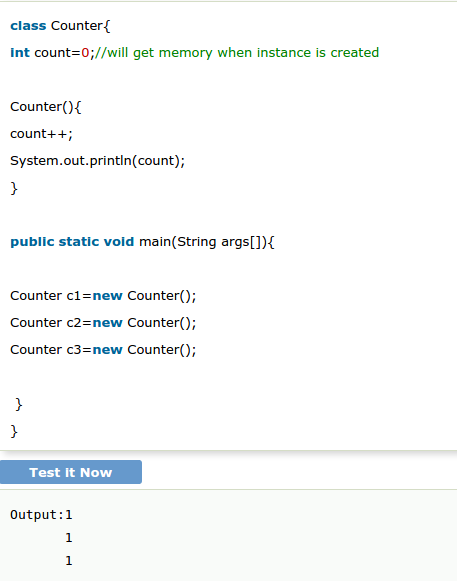

**(2) Program of counter by static variable**
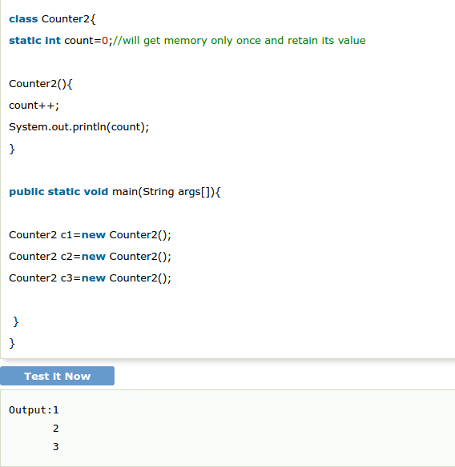

###21) What is static method?
* A static method **belongs to the class** rather than object of a class.
* A static method can be invoked without the need for creating an instance of a class.
* static method can access static data member and can change the value of it.

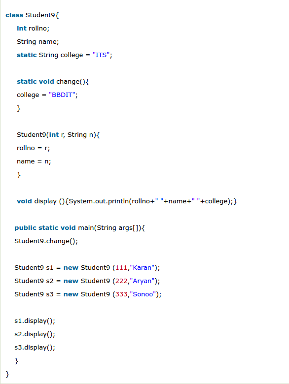
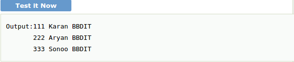

###22) Why main method is static?
Because object is not required to call static method if It were non-static method, jvm creats object first then call main() method that will lead to the problem of extra memory allocation.

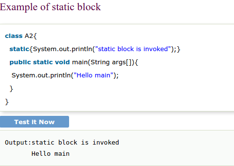

###24) Can we execute a program without main() method?
**Yes**, one of the way is static block.

###25) What if the static modifier is removed from the signature of the main method?
Program compiles. But at runtime throws an error "**NoSuchMethodError**".

###26) What is difference between static (class) method and instance method?

###27) What is this in java?
It is a keyword that that refers to the current object.  
(1) **the problem without this keyword**

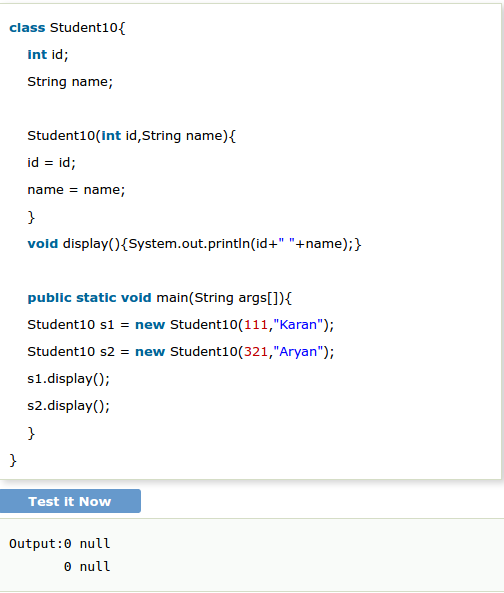

(2) **Solution of the above problem by this keyword**

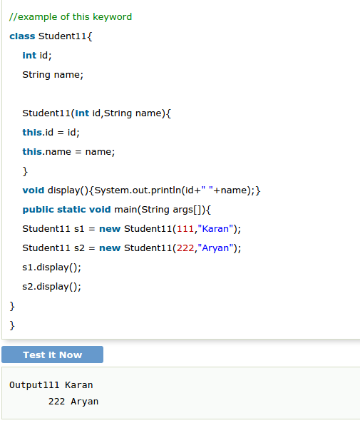

###28)What is Inheritance?
Inheritance is a mechanism in which one object acquires all the properties and behaviour of another object of another class. It represents IS-A relationship. It is used for **Code Resusability** and **Method Overriding**.  

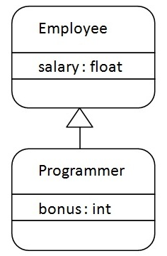

###29) Which class is the superclass for every class.
Object class.

###30) Why multiple inheritance is not supported in java?
To reduce the complexity and simplify the language, multiple inheritance is not supported in java in case of class.

###31) What is composition?
Holding the reference of the other class within some other class is known as composition.

###32) What is difference between aggregation and composition?
Aggregation represents weak relationship whereas composition represents strong relationship. For example: bike has an indicator (aggregation) but bike has an engine (compostion).

###33) Why Java does not support pointers?
Pointer is a variable that refers to the memory address. They are not used in java because they are **unsafe**(unsecured) and **complex to understand**.

###34) What is super in java?
It is a keyword that refers to the immediate parent class object.
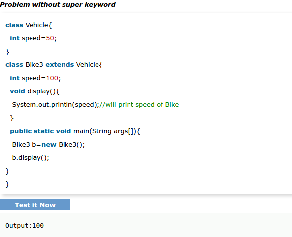
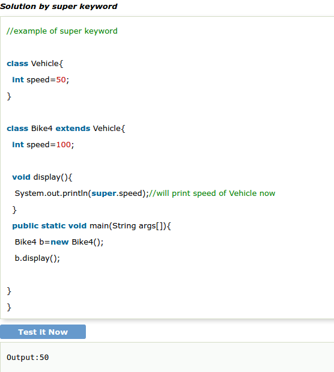

###35) Can you use this() and super() both in a constructor?
No. Because super() or this() must be the first statement.

###36)What is object cloning?
The object cloning is used to create the exact copy of an object.

###37) What is method overloading?
If a class have multiple methods by same name but different parameters, it is known as Method Overloading. It **increases the readability** of the program.
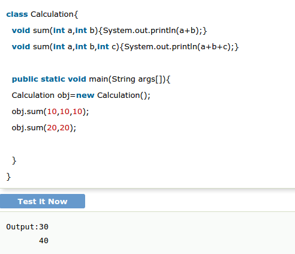

###38) Why method overloading is not possible by changing the return type in java?
Because of ambiguity.

###39) Can we overload main() method?
Yes, You can have many main() methods in a class by overloading the main method.
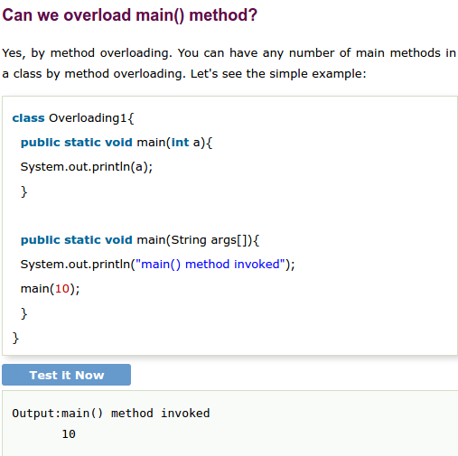

###40) What is method overriding？
If a subclass provides a specific implementation of a method that is already provided by its parent class, it is known as Method Overriding. It is used for **runtime polymorphism** and to provide the specific implementation of the method.

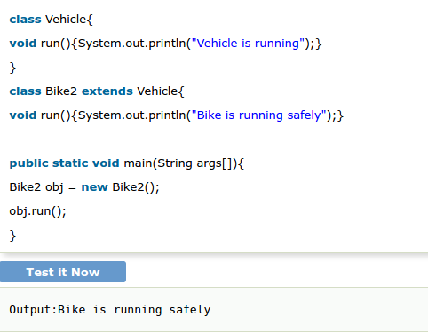

###41) Can we override static method?
**No**, you can't override the static method because they are the part of class not object.

###42) Why we cannot override static method?
It is because the static method is the part of class and it is bound with class whereas instance method is bound with object and static gets memory in class area and instance gets memory in heap.

###43) Can we override the overloaded method?
Yes.

###44) Difference between method Overloading and Overriding.
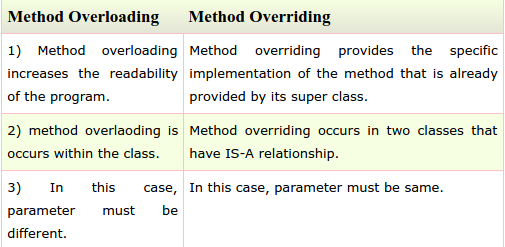

###45) Can you have virtual functions in Java?
**Yes**, all functions in Java are virtual by default.

###46) What is covariant return type?
Now, since java5, it is possible to override any method by changing the return type if the return type of the subclass overriding method is subclass type. It is known as covariant return type.

###47) What is final variable?
If you make any variable as final, you cannot change the value of final variable(It will be constant).

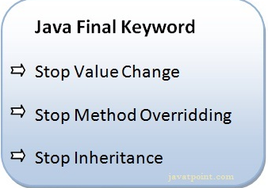

###48) What is final method?
Final methods can't be overriden.

###49) What is final class?
Final class can't be inherited. 

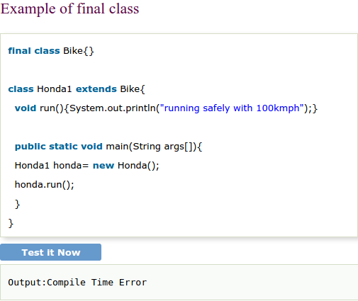

###50) What is blank final variable?
A final variable, not initalized at the time of declaration, is known as blank final variable.

###51) Can we intialize blank final variable?
**Yes**, only in constructor if it is non-static. If it is static blank final variable, it can be initialized only in the static block.

###52) Can you declare the main method as final?
Yes, such as, public static final void main(String[] args){}.

###53) What is Runtime Polymorphism?
* Runtime polymorphism or dynamic method dispatch is a process in which a call to an overridden method is resolved at runtime rather than at compile-time.
* In this process, an overridden method is called through the reference variable of a super class. The determination of the method to be called is based on the object being referred to by the reference variable.
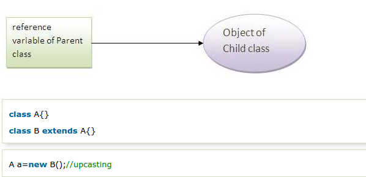
**Example**:
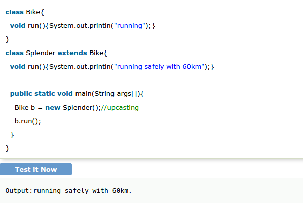

###54) Can you achieve Runtime Polymorphism by data members?
No.

###55) What is the difference between static binding and dynamic binding?
In case of static binding type of object is determined at compile time whereas in dynamic binding type of object is determined at runtime.

###56) What is abstraction?
Abstraction is a process of hiding the implementation details and showing only functionality to the user.
Abstraction lets you focus on what the object does instead of how it does it.

###57) What is the difference between abstraction and encapsulation?
Abstraction hides the implementation details whereas encapsulation wraps code and data into a single unit.

###58) What is abstract class?
A class that is declared as abstract is known as abstract class. It needs to be extended and its method implemented. It cannot be instantiated.

###59) Can there be any abstract method without abstract class?
**No**, if there is any abstract method in a class, that class must be abstract.

###60) Can you use abstract and final both with a method?
**No**, because abstract method needs to be overridden whereas you can't override final method.

###61) Is it possible to instantiate the abstract class?
**No**, abstract class **can never be instantiated**.

###62) What is interface?
Interface is a blueprint of a class that have static constants and abstract methods.It can be used to achieve fully abstraction and multiple inheritance.

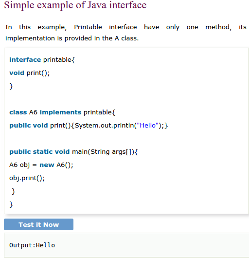

###63) Can you declare an interface method static?
**No**, because methods of an interface is abstract by default, and **static and abstract keywords can't be used together**.

###64) Can an Interface be final?
**No**, because its implementation is provided by another class.

###65) What is marker interface?
An interface that have no data member and method is known as a marker interface.For example Serializable, Cloneable etc.

###66) What is difference between abstract class and interface?
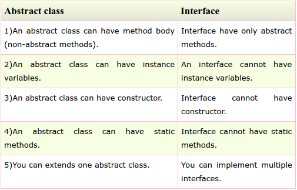

###67) Can we define private and protected modifiers for variables in interfaces?
No, they are implicitly public.

###68) When can an object reference be cast to an interface reference?
An object reference can be cast to an interface reference when the object implements the referenced interface.

###69) What is package?
A package is a group of similar type of **classes interfaces and sub-packages**. It provides access protection and removes naming collision.

###70) Do I need to import java.lang package any time? Why ?
No. It is by default loaded internally by the JVM.

###71) Can I import same package/class twice? Will the JVM load the package twice at runtime?
One can import the same package or same class multiple times. Neither compiler nor JVM complains about it.But the JVM will internally load the class only once no matter how many times you import the same class.

###72) What is static import ?
By static import, we can access the static members of a class directly, there is no to qualify it with the class name.

