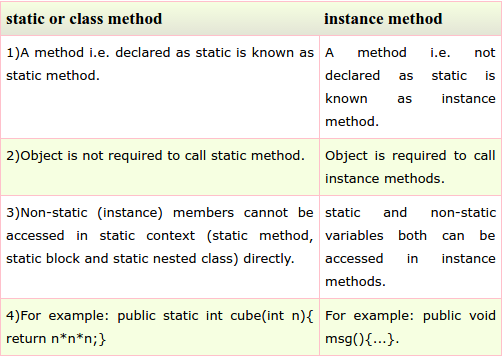

# Sec 2: OOP Concepts

###13) What is difference between object oriented programming language and object based programming language?
Object based programming languages follow all the features of OOPs **except Inheritance**. Examples of object based programming languages are **JavaScript**, VBScript etc.

###14) What will be the initial value of an object reference which is defined as an instance variable?
The object references are all initialized to null in Java.

###15) What is constructor?
Constructor is just like a method that is used to initialize the state of an object. It is invoked at the time of object creation.

###16) What is the purpose of default constructor?
The default constructor provides the default values to the objects. The java compiler creates a default constructor only if there is no constructor in the class.

###17) Does constructor return any value?
**yes**, that is current instance (You cannot use return type yet it returns a value).

###18)Is constructor inherited?
**No**, constructor is not inherited.

###19) Can you make a constructor final?
**No**, constructor can't be final.

###20) What is static variable?
* static variable is used to refer the common property of all objects (that is not unique for each object) e.g. company name of employees,college name of students etc.
* static variable **gets memory only once** in class area at the time of class loading.
(1) **Program of counter without static variable**

**(2) Program of counter by static variable**

###21) What is static method?
* A static method belongs to the class rather than object of a class.
* A static method can be invoked without the need for creating an instance of a class.
* static method can access static data member and can change the value of it.

###22) Why main method is static?
Because object is not required to call static method if It were non-static method,jvm creats object first then call main() method that will lead to the problem of extra memory allocation.

###24) Can we execute a program without main() method?
**Yes**, one of the way is static block.

###25) What if the static modifier is removed from the signature of the main method?
Program compiles. But at runtime throws an error "**NoSuchMethodError**".

###26) What is difference between static (class) method and instance method?

