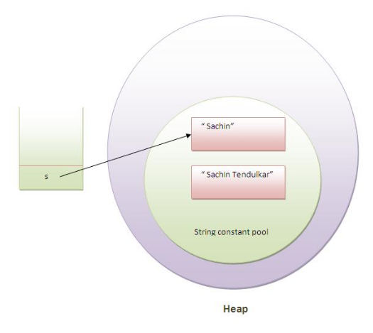
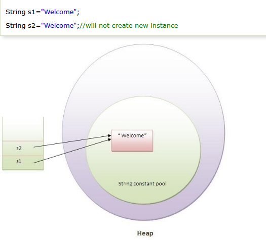
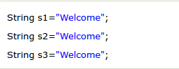
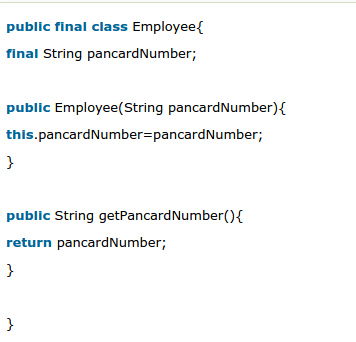

# Sec 4: String Handling

###84) What is the meaning of immutable in terms of String?
The simple meaning of immutable is unmodifiable or unchangeable. Once string object has been created, its value can't be changed.

###85) Why string objects are immutable in java?
Because java uses the concept of string literal. Suppose there are 5 reference variables,all referes to one object "sachin".If one reference variable changes the value of the object, it will be affected to all the reference variables. That is why string objects are immutable in java.

###86) How many ways we can create the string object?
There are two ways to create the string object, by string literal and by new keyword.
**1) String Literal**

**2) By new keyword**

###87) How many objects will be created in the following code?

Only one object.

###88) Why java uses the concept of string literal?
To make Java more memory efficient (because no new objects are created if it exists already in string constant pool).

###89)How many objects will be created in the following code?

Two objects, one in string constant pool and other in non-pool(heap).

###90) What is the basic difference between string and stringbuffer object?
String is an **immutable** object. **StringBuffer** is a mutable object.

###91) What is the difference between StringBuffer and StringBuilder ?
StringBuffer is **synchronized** whereas StringBuilder is not **synchronized**.

###92) How can we create immutable class in java ?
We can also create immutable class by creating final class that have final data members

###93) What is the purpose of toString() method in java ?

The toString() method returns the string representation of any object. If you print any object, java compiler internally invokes the toString() method on the object. So overriding the toString() method, returns the desired output, it can be the state of an object etc. depends on your implementation.

