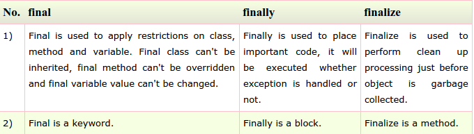

# Sec 6: Garbage Collection

###117) What is Garbage Collection?
Garbage collection is a process of **reclaiming the runtime unused objects**.It is performed for memory management.

###118) What is gc()?
gc() is a daemon (守护进程) thread.gc() method is defined in System class that is used to send request to JVM to perform garbage collection.

###119) What is the purpose of finalize() method?
finalize() method is invoked just before the object is garbage collected.It is used to **perform cleanup processing**.

###120) Can an unrefrenced objects be refrenced again?
Yes.

###121) What kind of thread is the Garbage collector thread?
Daemon thread.

###122) What is difference between final, finally and finalize?

**-final**: final is a keyword, final can be variable, method or class.You, can't change the value of final variable, can't override final method, can't inherit final class.  
**-finally**: finally block is used in exception handling. finally block is always executed.  
**-finalize()**:finalize() method is used in garbage collection.finalize() method is invoked just before the object is garbage collected.The finalize() method can be used to perform any cleanup processing.

###123) What is the purpose of the Runtime class?
The purpose of the Runtime class is to provide access to the Java runtime system.

###124) How will you invoke any external process in Java?
By Runtime.getRuntime().exec(?) method.

###125) What is the difference between the Reader/Writer class hierarchy and the InputStream/OutputStream class hierarchy?
The Reader/Writer class hierarchy is **character-oriented**, and the InputStream/OutputStream class hierarchy is **byte-oriented**.

###126) What an I/O filter?
An I/O filter is an object that reads from one stream and writes to another, usually altering the data in some way as it is passed from one stream to another.

