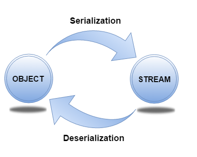

# Sec 7: Serialization, Networking and Reflection Questions

###127) What is serialization?
Serialization in java is a mechanism of **writing the state of an object into a byte stream**.
It is mainly used in Hibernate, RMI, JPA, EJB and JMS technologies.
The reverse operation of serialization is called deserialization.

###128) What is Deserialization?
Deserialization is the process of reconstructing the object from the serialized state. It is the reverse operation of serialization.

###129) What is transient keyword?
If you define any data member as transient,it will not be serialized.

###130)What is Externalizable?
Externalizable interface is used to write the state of an object into a byte stream in compressed format.It is not a marker interface.

###131)What is the difference between Serializalble and Externalizable interface?
Serializable is a marker interface but Externalizable is not a marker interface.When you use Serializable interface, your class is serialized automatically by default. But you can override writeObject() and readObject() two methods to control more complex object serailization process. When you use Externalizable interface, you have a complete control over your class's serialization process.

###132)How do I convert a numeric IP address like 192.18.97.39 into a hostname like java.sun.com?
By InetAddress.getByName("192.18.97.39").getHostName() where 192.18.97.39 is the IP address.

###133) What is reflection?
Reflection is the process of examining or modifying the runtime behaviour of a class at runtime.It is used in:  
-IDE (Integreted Development Environment) e.g. Eclipse, MyEclipse, NetBeans.  
-Debugger  
-Test Tools etc.  

###134) Can you access the private method from outside the class?
Yes, by changing the runtime behaviour of a class if the class is not secured.

