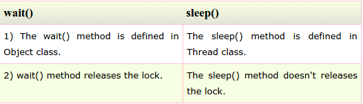

# Sec 9: Multithreading Questions

###1) What is multithreading?
Multithreading is a process of executing multiple threads simultaneously. Its main **advantage** is:  
-Threads share the same address space.  
-Thread is lightweight.  
-Cost of communication between process is low.  

###2) What is thread?
A thread is a lightweight subprocess.It is a separate path of execution.It is called separate path of execution because each thread runs in a separate stack frame.

###3) What is the difference between preemptive scheduling and time slicing?
Under **preemptive scheduling**, the highest priority task executes until it enters the waiting or dead states or a higher priority task comes into existence.   
Under **time slicing**, a task executes for a predefined slice of time and then reenters the pool of ready tasks. The scheduler then determines which task should execute next, based on priority and other factors.

###4) What does join() method?
The join() method waits for a thread to die. In other words, it causes the currently running threads to stop executing until the thread it joins with completes its task.

###5) What is difference between wait() and sleep() method?

###6) Is it possible to start a thread twice?
**No**, there is no possibility to start a thread twice. If we does, it throws an exception.

###7) Can we call the run() method instead of start()?
**yes**, but it will not work as a thread rather it will work as a normal object so there will not be context-switching between the threads.

###8) What about the daemon threads?
The daemon threads are basically the low priority threads that provides the background support to the user threads. It provides services to the user threads.

###9) Can we make the user thread as daemon thread if thread is started?
No, if you do so, it will throw IllegalThreadStateException

###10) What is shutdown hook?
The shutdown hook is basically a thread i.e. invoked implicitely before JVM shuts down. So we can use it perform clean up resource.

###11) When should we interrupt a thread?
We should interrupt a thread if we want to break out the sleep or wait state of a thread.

###12) What is synchronization?
Synchronization is the capabilility of control the access of multiple threads to any shared resource.It is used:    
-To **prevent thread interference**.  
-To **prevent consistency** problem.  

###13) What is the purpose of Synchronized block?
-Synchronized block is used to lock an object for any shared resource.  
-Scope of synchronized block is smaller than the method.  

###14) Can Java object be locked down for exclusive use by a given thread?
Yes. You can lock an object by putting it in a "synchronized" block. The locked object is inaccessible to any thread other than the one that explicitly claimed it.

###15) What is static synchronization?
If you make any static method as synchronized, the lock will be on the class not on object.

###16)What is the difference between notify() and notifyAll()?
The notify() is used to unblock one waiting thread whereas notifyAll() method is used to unblock all the threads in waiting state.

###17)What is deadlock?
Deadlock is a situation when two threads are waiting on each other to release a resource. Each thread waiting for a resource which is held by the other waiting thread.

