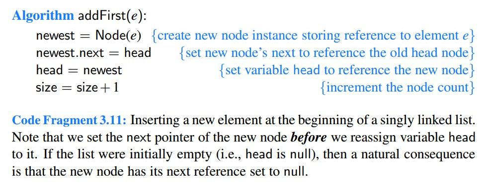

# Summary 1: Pointer and update

1. LinkedList的结构


2. insert a node


**注意**：```head = newest```，这是为了把head指针重新更新，指向新的node

3.  delete a node


4. 参考

> http://blog.csdn.net/feliciafay/article/details/6841115


